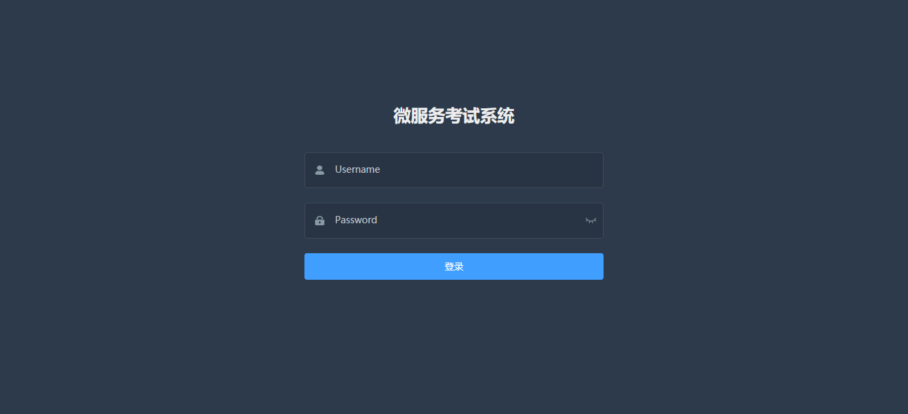
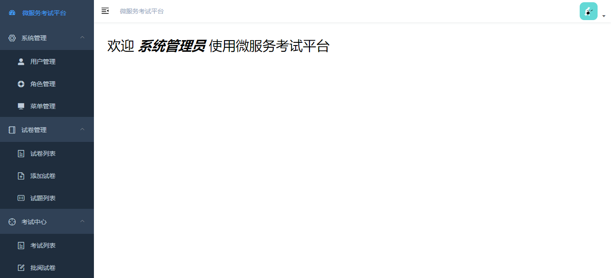
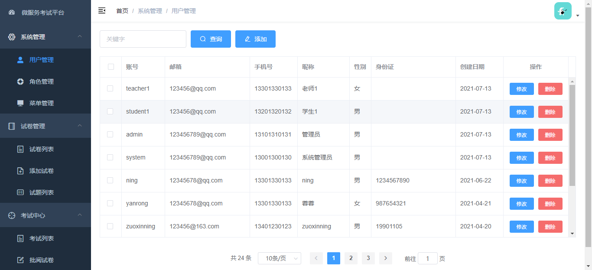
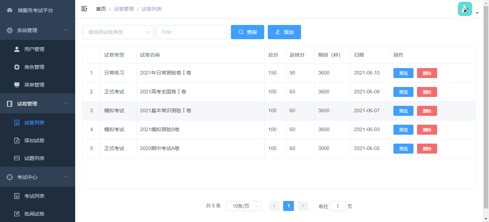
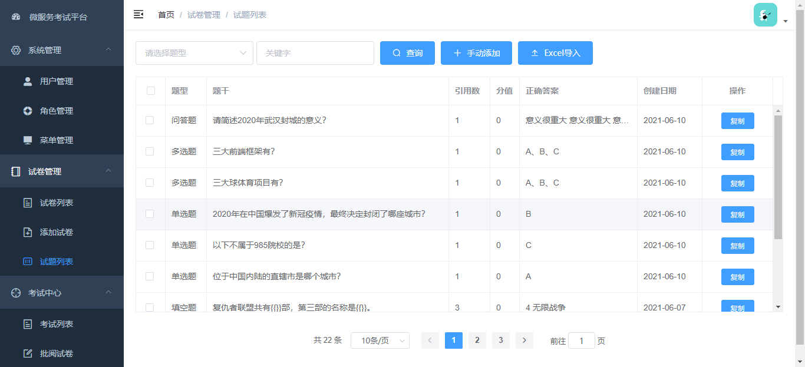
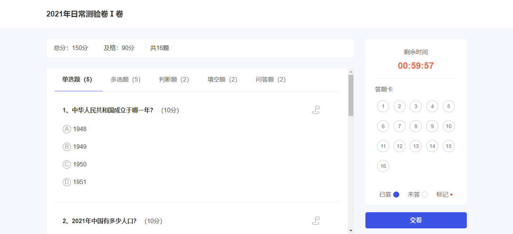
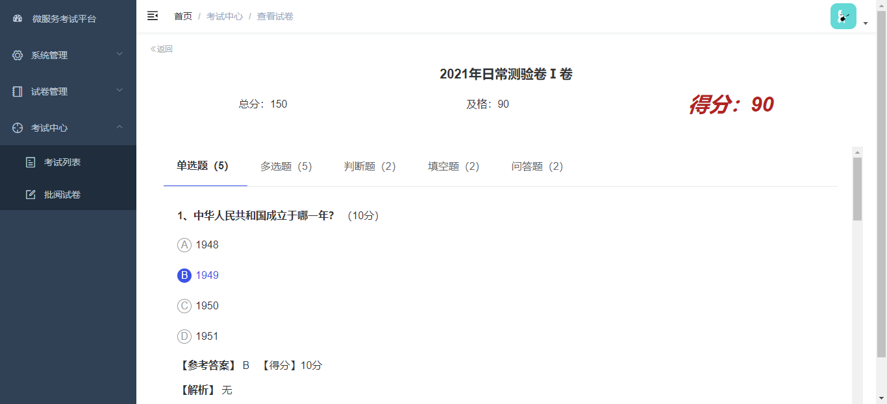

## 系统简介
* 采用前后端分离的模式，前端框架选型vue-element-admin，前端代码地址：     
Gitee：https://gitee.com/ningzxspace/exam-ning-web-v1  
Github：https://github.com/ningzuoxin/exam-ning-web-v1  
* 后端采用Spring Boot、Spring Cloud & Alibaba、Mybatis-plus。
* 注册中心、配置中心选型Nacos，权限认证使用OAuth2。
<table>
    <tr>
        <td>后端代码地址</td>
        <td>
            <a href="https://gitee.com/ningzxspace/exam-ning-springcloud-v1">https://gitee.com/ningzxspace/exam-ning-springcloud-v1</a><br/>
            <a href="https://github.com/ningzuoxin/exam-ning-springcloud-v1">https://github.com/ningzuoxin/exam-ning-springcloud-v1</a>
        </td>
    </tr>
    <tr>
        <td>前端代码地址</td>
        <td>
            <a href="https://gitee.com/ningzxspace/exam-ning-web-v1">https://gitee.com/ningzxspace/exam-ning-web-v1</a><br/>
            <a href="https://github.com/ningzuoxin/exam-ning-web-v1">https://github.com/ningzuoxin/exam-ning-web-v1</a>
        </td>
    </tr>
</table>

## 系统模块
~~~
exam-ning-springcloud-v1
├── doc                                 // 文档
├── exam-ning-springcloud-api           // 公共模块
├── exam-ning-springcloud-auth          // 认证中心[9527]
├── exam-ning-springcloud-gateway       // 网关模块[8080]
├── exam-ning-springcloud-system-exam   // 考试模块[9201]
├── exam-ning-springcloud-system-user   // 系统模块[9202]
~~~

## 系统功能
1. 用户管理：添加用户及用户基本信息的维护。
2. 角色管理：角色信息的维护及对应权限范围的控制。
3. 菜单管理：菜单权限信息的维护。
4. 试卷管理：添加试卷、预览试卷、发布试卷、删除试卷。
5. 试题管理：试题的管理，分为单选、多线、填空、判断、简答5钟题型。
6. 考试管理：考试、阅卷（客观题自动阅卷）、查看错题。

## 演示图

***

***

***

***

***

***

***


## 部署文档
1. 初始化数据库，数据库脚本文件在doc/sql目录，分别创建 exam-ning-springcloud-exam 和 exam-ning-springcloud-user 数据库，导入对应sql文件。 
2. 启动Nacos，下载Nacos，运行startup.cmd。参考：https://nacos.io/zh-cn/docs/quick-start.html
```
【注意事项】
1、注意下 nacos 的版本，本项目依赖升级后 nacos-client 的版本是 2.0.3。
2、在使用 docker 启动 nacos 时，要注意同时暴露 9848 端口，参考如下命令：
docker run --name nacos-server -e MODE=standalone -p 8848:8848 -p 9848:9848 -d nacos/nacos-server:latest
```
3. 启动Redis。参考：https://www.cnblogs.com/skmobi/p/11696620.html
4. 依次启动exam-ning-springcloud-gateway、exam-ning-springcloud-auth、exam-ning-springcloud-system-exam、exam-ning-springcloud-system-user。
5. 下载前端代码：https://gitee.com/ningzxspace/exam-ning-web-v1 或 https://github.com/ningzuoxin/exam-ning-web-v1，安装依赖【npm install】，本地运行【npm run dev】。
6. 浏览器访问http://localhost:9528/，学生【student1/123456】、老师【teacher1/123456】、管理员【system/system】。
7. 接口文档地址：http://127.0.0.1:8080/swagger-ui.html

## 欢迎Star留言入群交流
***

